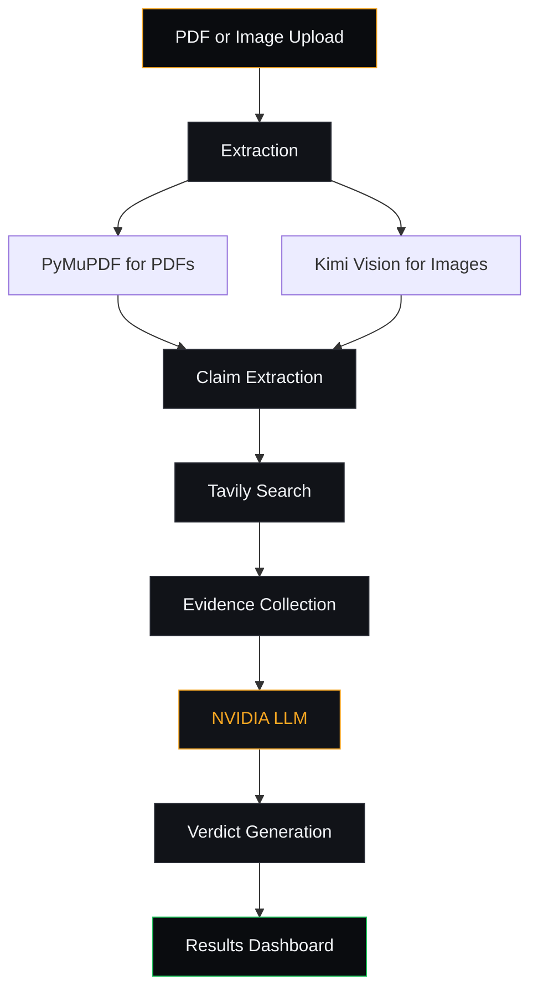

---

## Preview


A quick look at the full pipeline — upload a PDF or an image, watch
live claim extraction and web search, and review the per-claim
evidence-backed verdict dashboard.

<div align="center">
# TruthLayer

**AI-powered Fact Verification Platform for PDFs and Images**

Upload a PDF **or an image** — TruthLayer extracts every factual
claim, searches live web sources, and renders an evidence-backed
verdict for each one.

[](#)
[](#tech-stack)
[](#tech-stack)
[](#tech-stack)
[](#license)
[](#testing)

</div>

---

## Preview


A quick look at the full pipeline — upload a PDF, watch live claim
extraction and web search, and review the per-claim verdict dashboard
with the corrected facts.

---

## Live Demo

**[https://truthlayernitish.vercel.app](https://truthlayernitish.vercel.app)**

Open the URL in a browser, drop a PDF **or an image (PNG/JPG/WEBP)**
on the upload zone, and watch the dashboard fill with per-claim
verdicts in under a minute.

---

## GitHub Repository

**[https://github.com/nitish-niraj/truthlayer](https://github.com/nitish-niraj/truthlayer)**

---

## What is new in v2.0?

| Area | v1.0 | v2.0 |
|---|---|---|
| Input formats | PDF only | **PDF + Image (PNG/JPG/WEBP)** |
| Image vision | — | **Kimi K2.6 vision extracts claims from charts, infographics, and screenshots** |
| Evidence panel | Inline source links | **Accordion with multi-source support, `aria-expanded`, `rel="noopener noreferrer"`** |
| Processing steps | Static stepper | **Dynamic stepper that swaps text + status messages per input type** |
| File preview | Icon only | **Image preview card with thumbnail, filename, and format badge** |
| Result metadata | Counts only | **Counts + input type + filename + processing time** |
| Error handling | Plain error message | **Typed error envelope + global React ErrorBoundary + offline detection** |
| Health endpoint | `{"status":"ok","version":"1.0"}` | **`{status, version, vision, search, model, base_url}` — advisory; 200 even if degraded** |
| Startup validation | None | **Detects dummy/short/whitespace API keys, bad URLs, mis-set limits; abort on `STRICT_STARTUP_VALIDATION=1`** |
| Trap-dataset testing | None | **`test_assets/expected_results.json` + regression test that auto-skips on fresh checkouts** |
| Test count | 12 | **163 backend + 28 frontend (191 total)** |
| Bundle size | — | **496 kB / 157 kB gzipped** |

---

## Project Overview

TruthLayer is an end-to-end fact-verification pipeline for documents
and images. It reads the file, extracts every verifiable factual
claim, retrieves live web evidence for each claim, and asks an LLM to
render a verdict (`verified` / `inaccurate` / `false`) backed by
source URLs.

The result is a structured report — one verdict per claim — with
plain-English explanations, the corrected fact (when applicable), and
the source URLs that informed each judgement.

**The five-stage flow:**

```
PDF or Image  →  Claim Extraction  →  Evidence Search  →  AI Verification  →  Results Dashboard
                       (vision)            (Tavily)            (LLM)              (React)
```

TruthLayer is built for:

- **Researchers and journalists** who need to audit long reports or
  chart-heavy infographics quickly.
- **Product, legal, and compliance teams** that want a second pair of
  eyes on vendor / partner / market-research documents.
- **Anyone** who has ever finished a 60-page PDF (or a screenshot
  full of numbers) and wondered *"wait, is that actually true?"*

---

## Key Features

| Feature | Description |
|---|---|
| **PDF + Image upload** | Drag-and-drop a PDF (≤10 MB) **or an image (PNG/JPG/WEBP, ≤5 MB)**. |
| **Text & vision extraction** | PyMuPDF for PDFs; **Kimi K2.6 vision** for images including charts, infographics, and tables. |
| **Claim extraction** | `moonshotai/kimi-k2.6` (NVIDIA Inference API) extracts structured verifiable claims from both sources. |
| **Evidence search** | Tavily (advanced, top 5) returns ranked web evidence per claim. |
| **Verdict generation** | The same model evaluates each claim against the evidence consensus. |
| **Evidence panel** | Per-claim accordion with the source URLs that informed the verdict. |
| **Processing metrics** | The dashboard reports the wall-clock processing time alongside the result counts. |
| **Dynamic stepper** | The processing screen shows PDF-specific or image-specific steps and status messages. |
| **Production hardening** | Background-job pipeline, request timing, structured logs, typed error envelopes, startup validation. |
| **Trap-dataset regression** | Drop adversarial PDFs/images into `test_assets/` and the regression suite auto-detects verdict drift. |

---

## Tech Stack

### Frontend
- **React 18** — UI library
- **Vite 5** — dev server and production build
- **Tailwind CSS 3.5** — utility-first styling with a custom dark "Intelligence Terminal" design system
- **Framer Motion 11** — screen transitions and stepper animations
- **Axios 1.4** — HTTP client
- **react-dropzone 14** — drag-and-drop upload
- **lucide-react** — icon set
- **vitest + @testing-library/react** — component tests
- **ErrorBoundary** — class-based global render-error trap

### Backend
- **FastAPI 0.116** — async web framework
- **Python 3.11+** — runtime
- **PyMuPDF (≥1.24)** — PDF parsing
- **Pillow + magic bytes** — image validation
- **Pydantic 2.13** — typed request/response models
- **uvicorn** — ASGI server
- **httpx** — TestClient
- **pytest 8.4** — 163 tests across unit, integration, stress, and regression

### AI
- **NVIDIA Inference API** — Kimi K2.6 (`moonshotai/kimi-k2.6`) for
  claim extraction (thinking on, PDF), vision claim extraction
  (thinking on, image), and verdict evaluation (thinking off,
  structured JSON).

### Search
- **Tavily** — live web search, advanced depth, top-5 results, tier-ranked
  by source quality.

### Deployment
- **Vercel** — frontend hosting (CI on push to `main`)
- **Render** — backend hosting (free tier, single web worker)

---

## Architecture



The frontend never blocks on the pipeline: `POST /api/verify`
(returns a `job_id` in <100 ms) and `POST /api/verify-image` both
run as background tasks. The client polls
`GET /api/verify/{job_id}` every 1.5 s for live progress updates
and the final result, so a 60-second pipeline does not tie up the
browser or trip a reverse-proxy HTTP timeout.

The image path also uses vision for claim extraction, then drops
into the same Tavily + LLM verdict pipeline as the PDF path —
the `ResultsDashboard` is shared between both inputs.

---

## Installation

### Prerequisites

- **Python 3.11+** and **Node.js 18+**
- API keys for [NVIDIA Inference](https://build.nvidia.com/) and
  [Tavily](https://tavily.com/)

### 1. Clone the repository

```bash
git clone https://github.com/nitish-niraj/truthlayer.git
cd truthlayer
```

### 2. Backend

```bash
cd backend
python -m venv venv
# Windows
venv\Scripts\activate
# macOS / Linux
source venv/bin/activate

pip install -r requirements.txt
cp .env.example .env       # then fill in NVIDIA_API_KEY and TAVILY_API_KEY
uvicorn main:app --reload --port 8000
```

Backend now serves on `http://localhost:8000`. Interactive docs at
`http://localhost:8000/docs`. Try the health endpoint:

```bash
curl http://localhost:8000/api/health
# {"status":"ok","version":"2.0","vision":true,"search":true,"model":"moonshotai/kimi-k2.6","base_url":"https://integrate.api.nvidia.com/v1"}
```

### 3. Frontend

```bash
cd ../frontend
npm install
cp .env.example .env       # VITE_API_URL=http://localhost:8000
npm run dev
```

Frontend now serves on `http://localhost:5173` and talks to the
backend automatically.

### Environment Variables

**Backend** — `backend/.env`

| Key | Description |
|---|---|
| `NVIDIA_API_KEY` | NVIDIA / Kimi K2.6 API key |
| `TAVILY_API_KEY` | Tavily search API key |
| `FRONTEND_URL` | Allowed CORS origin (set to your Vercel domain in prod) |
| `MAX_FILE_SIZE_MB` | Upload size cap (default `10`) |
| `MAX_IMAGE_SIZE_MB` | Image upload size cap (default `5`) |
| `MAX_CLAIMS` | Max claims processed per document (default `20`) |
| `MAX_SEARCH_RESULTS` | Tavily results per claim (default `5`) |
| `SEARCH_TIMEOUT_SECONDS` | Tavily per-claim timeout (default `15`) |
| `VERIFY_HARD_TIMEOUT_SECONDS` | Per-document pipeline wall budget (default `120`) |
| `STRICT_STARTUP_VALIDATION` | Set to `1` to abort boot on startup validation errors (default `0`, advisory) |

**Frontend** — `frontend/.env`

| Key | Description |
|---|---|
| `VITE_API_URL` | Backend base URL |

> **Security:** `backend/.env` is git-ignored. Never commit real
> keys. Startup validation will WARN about dummy or short keys in
> the logs at boot — but the server still starts so the dashboard
> can come up and report the issue.

---

## API Endpoints

All endpoints are defined in `backend/routers/verify.py` and return
typed Pydantic models from `backend/models/schemas.py`.

| Method | Path | Purpose |
|---|---|---|
| `GET`  | `/api/health` | Liveness check — `{status, version, vision, search, model, base_url}` |
| `POST` | `/api/upload` | Upload a PDF, extract its text (PyMuPDF) |
| `POST` | `/api/upload-image` | Upload an image, validate magic bytes + size |
| `POST` | `/api/extract-claims` | LLM: extract `ExtractedClaim[]` from text |
| `POST` | `/api/extract-image-claims` | **Vision LLM: extract `ExtractedClaim[]` from an image** |
| `POST` | `/api/search-claim` | Tavily: ranked evidence for a single claim |
| `POST` | `/api/generate-verdict` | LLM: verdict for a claim + evidence list |
| `POST` | `/api/verify-claim` | Pipeline: search + verdict for a single claim |
| `POST` | `/api/verify` | **Pipeline: end-to-end verification for a document** (background-job) |
| `POST` | `/api/verify-image` | **Pipeline: end-to-end verification for an image** (background-job) |
| `GET`  | `/api/verify/{job_id}` | Poll a background verify job for status + result |

`/api/verify` and `/api/verify-image` accept either multipart
(`file=...`) or JSON (`{ "text": "...", "filename": "..." }`) and
return `{ "job_id": "...", "status": "pending" }` in <100 ms. The
client then polls `/api/verify/{job_id}` every 1.5 s until the
status becomes `completed`, `partial`, or `failed`. The final
payload includes `processing_time_seconds`, summary statistics, and
per-claim `VerifiedClaim` records.

---

## Testing
TruthLayer ships with **163 backend tests** (unit, integration,
trap-dataset, stress) and **28 frontend tests** (vitest +
@testing-library/react).

```bash
# Backend
cd backend
pytest tests/ -v
# 163 passed, 1 skipped (the trap-dataset regression test
# auto-skips when test_assets/expected_results.json has no fixtures)

# Frontend
cd ../frontend
npm test
# 28 passed
```

### Test categories

| Category | File | Purpose |
|---|---|---|
| Production hardening | `test_production_hardening.py` | Health endpoint shape, startup validation (dummy/short/whitespace keys, bad URLs, bad limits, strict mode), error envelope helpers |
| Trap-dataset regression | `test_trap_dataset.py` | Loads `test_assets/expected_results.json` and asserts the per-fixture verdict counts stay within tolerance |
| Stress | `test_stress.py` | 50+ claims, 30 concurrent image claims, vision timeout → 503, search-raising recovery, slow-verdict cutoff, mixed verdict shape integrity, concurrent health probes |
| Frontend components | `*.test.jsx` | FilePreviewCard, EvidencePanel, ResultMetadataCard, ResultsDashboard, ProcessingScreen, ErrorBoundary |

### Trap dataset

Drop adversarial PDFs/images into `test_assets/pdfs/` and
`test_assets/images/`, record expected verdict counts in
`test_assets/expected_results.json`, and the regression suite
asserts the live pipeline stays within tolerance. See
[`test_assets/README.md`](test_assets/README.md) for the schema.

---

## Screenshots

### Upload — PDF


Drag-and-drop a PDF, in-browser validation, paginated text
extraction.

### Upload — Image


Drop a chart, infographic, or screenshot. The file preview card
shows the thumbnail, filename, and format badge.

### Processing


The dynamic stepper shows PDF-specific or image-specific steps
based on the uploaded file type.

### Results


Per-claim verdicts with explanations, corrected facts, source
URLs, and the wall-clock processing time.

### Evidence expanded


Each claim's evidence accordion shows the full source list with
`rel="noopener noreferrer"` and `aria-expanded` for accessibility.

### Verification Report


The structured verification report — shareable and print-ready.

### Error screen


Typed error envelope from the backend → user-friendly message
on screen. The global ErrorBoundary catches render-time errors
with a one-click reload.

> Full resolution originals are in
> [`docs/screenshots/`](docs/screenshots/). Submission-grade
> screenshots for reviewers live in [`demo/screenshots/`](demo/screenshots/)
> (placeholders until you generate them locally).

---

## Demo Video

A complete walkthrough of the product is in
[`docs/demo/truth-layers.mp4`](docs/demo/truth-layers.mp4).

The video covers:

1. **Uploading a PDF** — drag-and-drop, validation, queued state.
2. **Uploading an image** — chart or screenshot, vision-based
   claim extraction.
3. **Processing workflow** — the live stepper, status rotation,
   and progress bar.
4. **Results dashboard** — per-claim verdicts, summary counts,
   evidence, processing time.
5. **Export report** — opening the print-formatted verification
   report.

---

## Future Improvements

- **Streaming verification** — server-sent events so verdicts
  appear claim-by-claim instead of waiting for the full pipeline
  to finish.
- **Multi-document analysis** — drop several PDFs at once and
  compare claims across them.
- **Batch processing** — background queue for large document sets.
- **Team collaboration** — shared workspaces, comments, and
  verification history.
- **Persistent history** — per-user dashboards of past runs
  (currently in-memory; would need a database on Render).
- **Source-tier visualisation** — diversity score and tier badges
  on every evidence card.
- **Pre-signed uploads** — push large files straight to object
  storage to bypass the 30 s Render proxy timeout on the upload
  step.

---

## Author

**Nitish Kumar**

TruthLayer v2.0 — an AI-powered fact-verification platform that
handles both long-form PDFs and chart-heavy images end-to-end,
with claim extraction, live evidence search, and evidence-backed
verdicts.

- Live: [truthlayernitish.vercel.app](https://truthlayernitish.vercel.app)
- Repo: [github.com/nitish-niraj/truthlayer](https://github.com/nitish-niraj/truthlayer)

---

## License

MIT — see [LICENSE](LICENSE) for details.
