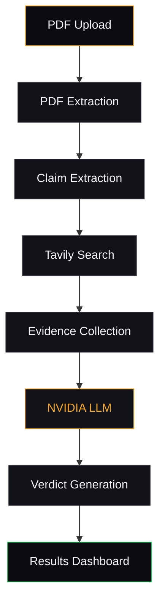
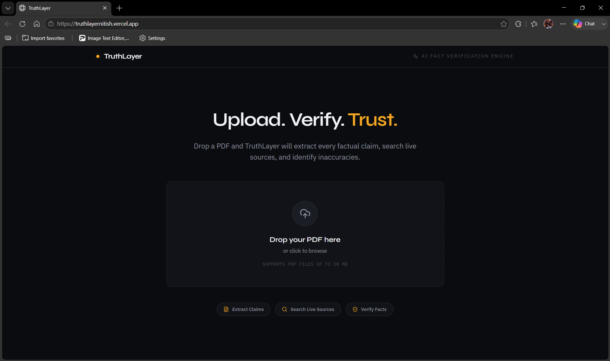
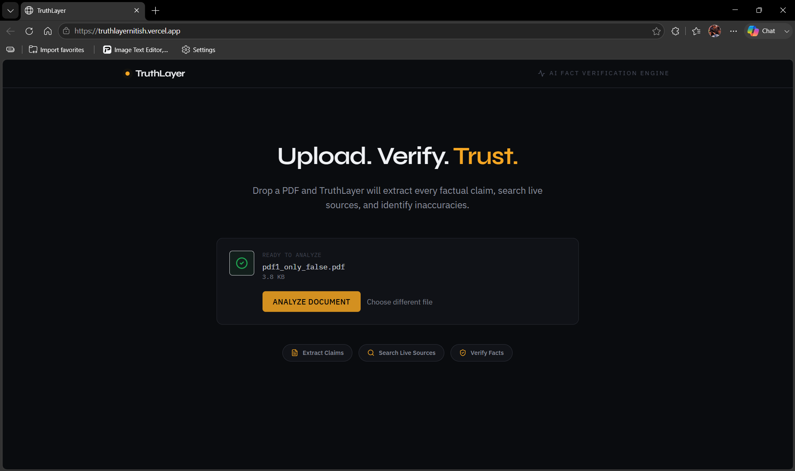
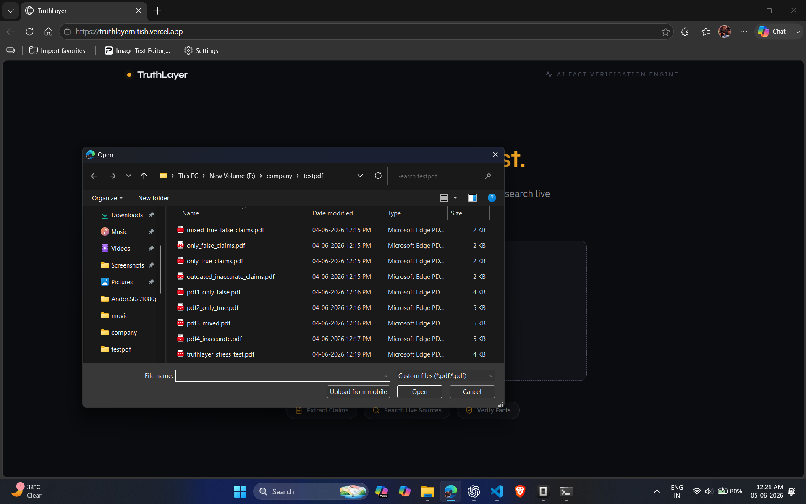
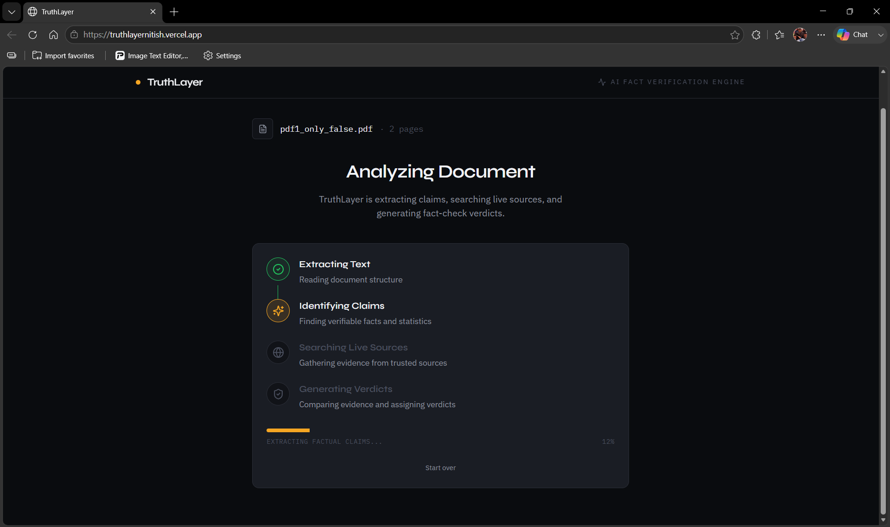
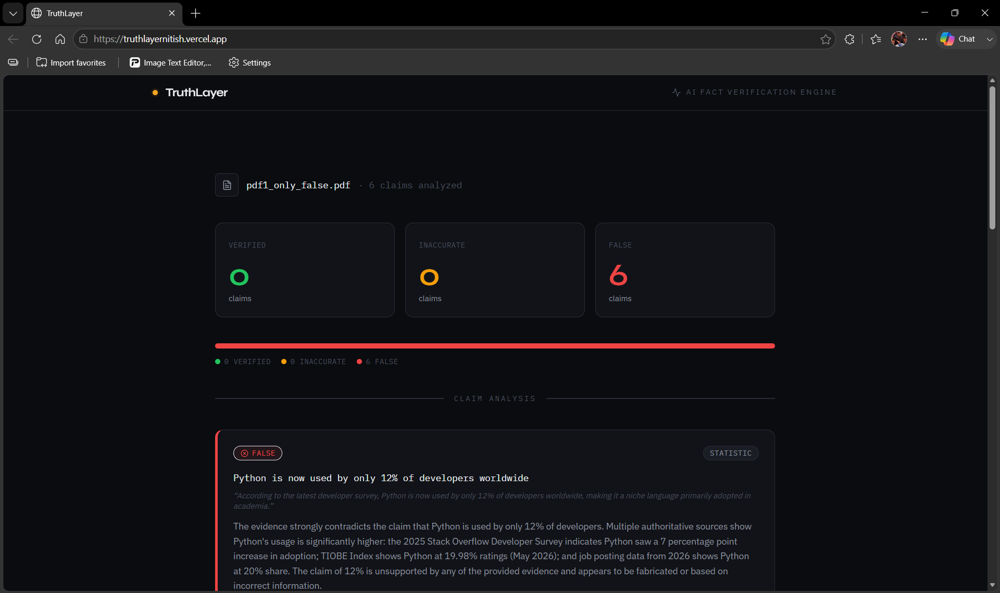
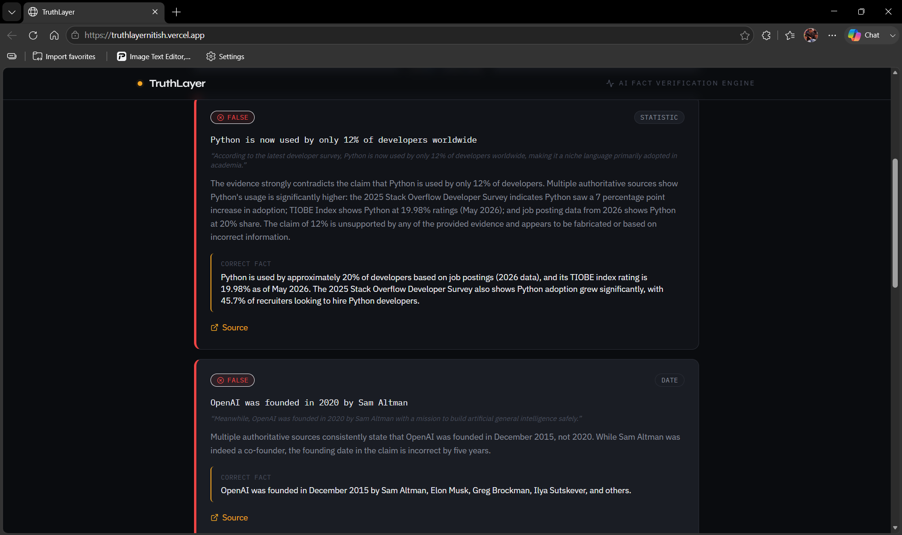
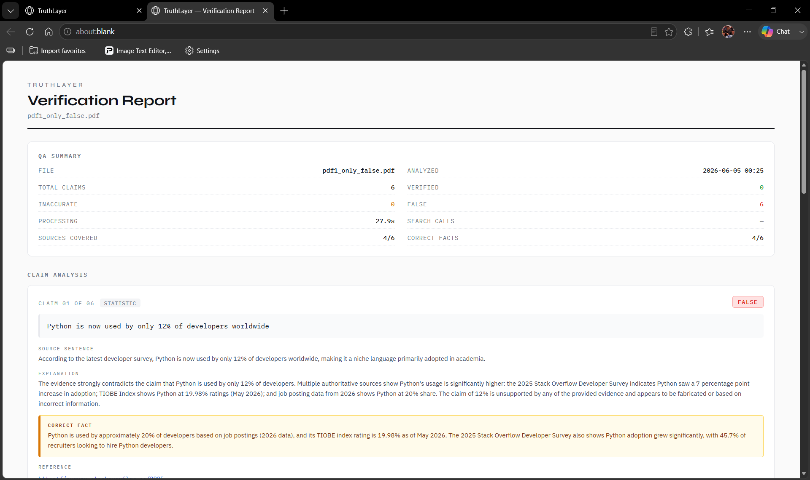
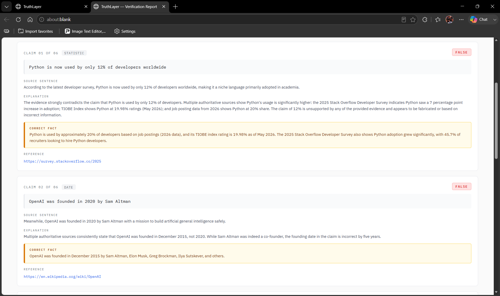
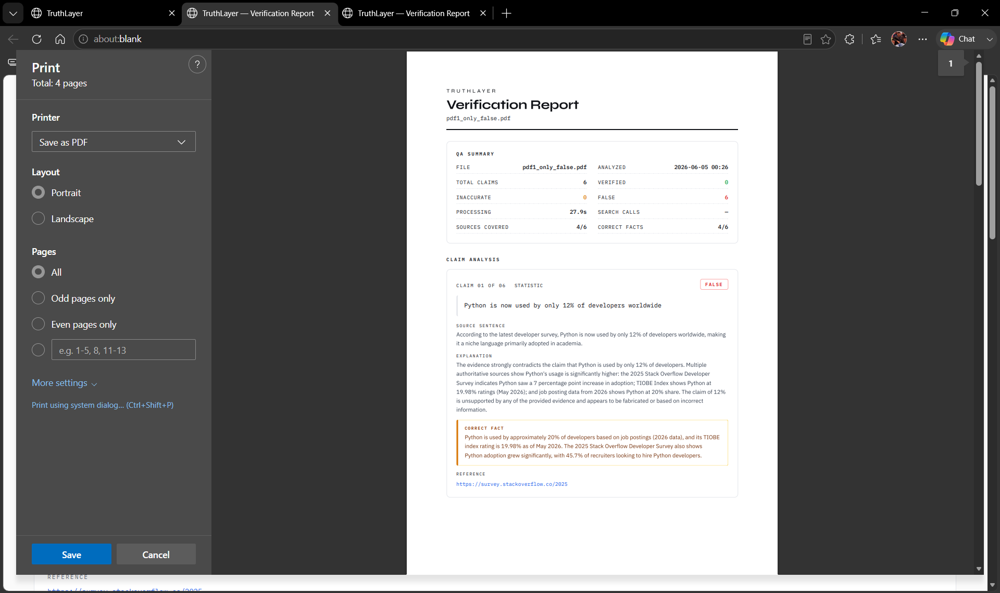

<div align="center">

# TruthLayer

**AI-powered PDF Fact Verification Platform**

Upload a PDF — TruthLayer extracts every factual claim, searches live web
sources, and renders an evidence-backed verdict for each one.

[](#)
[](#tech-stack)
[](#tech-stack)
[](#tech-stack)
[](#license)

</div>

---

## Preview


A quick look at the full pipeline — upload a PDF, watch live claim
extraction and web search, and review the per-claim verdict dashboard
with the corrected facts.

---

## Live Demo

**[https://truthlayernitish.vercel.app](https://truthlayernitish.vercel.app)**

Open the URL in a browser, drop a PDF on the upload zone, and watch the
dashboard fill with per-claim verdicts in under a minute.

---

## GitHub Repository

**[https://github.com/nitish-niraj/truthlayer](https://github.com/nitish-niraj/truthlayer)**

---

## Project Overview

TruthLayer is an end-to-end fact-verification pipeline for PDF documents. It
reads a document, extracts every verifiable factual claim it contains,
retrieves live web evidence for each claim, and asks an LLM to render a
verdict (`verified` / `inaccurate` / `false`) backed by source URLs.

The result is a structured report — one verdict per claim — with plain-English
explanations, the corrected fact (when applicable), and the source URLs that
informed each judgement.

**The five-stage flow:**

```
PDF Upload  →  Claim Extraction  →  Evidence Search  →  AI Verification  →  Results Dashboard
```

TruthLayer is built for:

- **Researchers and journalists** who need to audit long reports quickly.
- **Product, legal, and compliance teams** that want a second pair of eyes on
  vendor / partner / market-research documents.
- **Anyone** who has ever finished a 60-page PDF and wondered *"wait, is
  that number actually true?"*

---

## Key Features

| Feature | Description |
|---|---|
| **PDF Upload** | Drag-and-drop a PDF, in-browser validation, paginated text extraction. |
| **Text Extraction** | PyMuPDF parses all pages, joins them into clean text. |
| **Claim Extraction** | `moonshotai/kimi-k2.6` (NVIDIA Inference API) extracts structured verifiable claims. |
| **Evidence Search** | Tavily (advanced, top 5) returns ranked web evidence per claim. |
| **Verdict Generation** | The same model evaluates each claim against the evidence consensus. |
| **Verification Dashboard** | Per-claim colour-coded verdicts with explanations, corrected facts, and source URLs. |
| **Export Report** | A print-ready verification report (View / Export) suitable for sharing. |
| **Production Monitoring** | Background-job pipeline, request timing, structured logs, defensive fallbacks. |

---

## Tech Stack

### Frontend
- **React 18** — UI library
- **Vite 5** — dev server and production build
- **Tailwind CSS 3.5** — utility-first styling with a custom dark "Intelligence Terminal" design system
- **Framer Motion 11** — screen transitions and stepper animations
- **Axios 1.4** — HTTP client
- **react-dropzone 14** — drag-and-drop upload
- **lucide-react** — icon set

### Backend
- **FastAPI 0.116** — async web framework
- **Python 3.11+** — runtime
- **PyMuPDF (≥1.24)** — PDF parsing
- **Pydantic 2.13** — typed request/response models
- **uvicorn** — ASGI server
- **httpx** — TestClient

### AI
- **NVIDIA Inference API** — Kimi K2.6 (`moonshotai/kimi-k2.6`) for both
  claim extraction (thinking on) and verdict evaluation (thinking off,
  structured JSON)

### Search
- **Tavily** — live web search, advanced depth, top-5 results, tier-ranked
  by source quality

### Deployment
- **Vercel** — frontend hosting (CI on push to `main`)
- **Render** — backend hosting (free tier, single web worker)

---

## Architecture



The frontend never blocks on the pipeline: `POST /api/verify` returns a
`job_id` in <100 ms and the actual work runs as a background task. The
client polls `GET /api/verify/{job_id}` every 1.5 s for live progress
updates and the final result, so a 60-second pipeline does not tie up the
browser or trip a reverse-proxy HTTP timeout.

---

## Installation

### Prerequisites

- **Python 3.11+** and **Node.js 18+**
- API keys for [NVIDIA Inference](https://build.nvidia.com/) and
  [Tavily](https://tavily.com/)

### 1. Clone the repository

```bash
git clone https://github.com/nitish-niraj/truthlayer.git
cd truthlayer
```

### 2. Backend

```bash
cd backend
python -m venv venv
# Windows
venv\Scripts\activate
# macOS / Linux
source venv/bin/activate

pip install -r requirements.txt
cp .env.example .env       # then fill in NVIDIA_API_KEY and TAVILY_API_KEY
uvicorn main:app --reload --port 8000
```

Backend now serves on `http://localhost:8000`. Interactive docs at
`http://localhost:8000/docs`.

### 3. Frontend

```bash
cd ../frontend
npm install
cp .env.example .env       # VITE_API_URL=http://localhost:8000
npm run dev
```

Frontend now serves on `http://localhost:5173` and talks to the backend
automatically.

### Environment Variables

**Backend** — `backend/.env`

| Key | Description |
|---|---|
| `NVIDIA_API_KEY` | NVIDIA / Kimi K2.6 API key |
| `TAVILY_API_KEY` | Tavily search API key |
| `FRONTEND_URL` | Allowed CORS origin (set to your Vercel domain in prod) |
| `MAX_FILE_SIZE_MB` | Upload size cap (default `10`) |
| `MAX_CLAIMS` | Max claims processed per document (default `20`) |
| `MAX_SEARCH_RESULTS` | Tavily results per claim (default `5`) |
| `SEARCH_TIMEOUT_SECONDS` | Tavily per-claim timeout (default `8`) |

**Frontend** — `frontend/.env`

| Key | Description |
|---|---|
| `VITE_API_URL` | Backend base URL |

> **Security:** `backend/.env` is git-ignored. Never commit real keys.

---

## API Endpoints

All endpoints are defined in `backend/routers/verify.py` and return typed
Pydantic models from `backend/models/schemas.py`.

| Method | Path | Purpose |
|---|---|---|
| `GET`  | `/api/health` | Liveness check — `{"status":"ok","version":"1.0"}` |
| `POST` | `/api/upload` | Upload a PDF, extract its text (PyMuPDF) |
| `POST` | `/api/extract-claims` | LLM: extract `ExtractedClaim[]` from text |
| `POST` | `/api/search-claim` | Tavily: ranked evidence for a single claim |
| `POST` | `/api/generate-verdict` | LLM: verdict for a claim + evidence list |
| `POST` | `/api/verify-claim` | Pipeline: search + verdict for a single claim |
| `POST` | `/api/verify` | **Pipeline: end-to-end verification for a document** (background-job) |
| `GET`  | `/api/verify/{job_id}` | Poll a background verify job for status + result |

`/api/verify` accepts `{ "text": "...", "filename": "..." }` and returns
`{ "job_id": "...", "status": "pending" }` in <100 ms. The client then
polls `/api/verify/{job_id}` every 1.5 s until the status becomes
`completed`, `partial`, or `failed`. The final payload includes summary
statistics and per-claim `VerifiedClaim` records.

---

## Screenshots

### Home — Upload



The landing screen — drag-and-drop a PDF or click to browse.

### File Selected



The dropzone confirms the file is queued for analysis.

### File Picker



Native file picker integration with PDF-only validation.

### Analyzing



Live stepper with rotating status messages during claim extraction,
search, and verdict generation.

### Results — Output



Per-claim verdicts with explanations, corrected facts, and source URLs.

### Results — Output (continued)



The dashboard scrolls to reveal all claims, even for long documents.

### Verification Report



The structured verification report — shareable and print-ready.

### Verification Report (continued)



Every claim with its evidence-backed verdict in one scrollable view.

### Export Report



The export flow produces a print-formatted report suitable for sharing
with stakeholders.

> Full resolution originals are in [`docs/screenshots/`](docs/screenshots/).

---

## Demo Video

A complete walkthrough of the product is in
[`docs/demo/truth-layers.mp4`](docs/demo/truth-layers.mp4).

The video covers:

1. **Uploading a PDF** — drag-and-drop, validation, queued state.
2. **Processing workflow** — the live stepper, status rotation, and
   progress bar.
3. **Results dashboard** — per-claim verdicts, summary counts, evidence.
4. **Export report** — opening the print-formatted verification report.

---

## Future Improvements

- **Streaming verification** — server-sent events so verdicts appear
  claim-by-claim instead of waiting for the full pipeline to finish.
- **Multi-document analysis** — drop several PDFs at once and compare
  claims across them.
- **Batch processing** — background queue for large document sets.
- **Team collaboration** — shared workspaces, comments, and
  verification history.
- **Persistent history** — per-user dashboards of past runs (currently
  in-memory; would need a database on Render).
- **Source-tier visualisation** — diversity score and tier badges on
  every evidence card.

---

## Author

**Nitish Kumar**

Built as the final release candidate of TruthLayer — an AI-powered PDF
fact-verification platform with end-to-end claim extraction, live evidence
search, and evidence-backed verdicts.

- Live: [truthlayernitish.vercel.app](https://truthlayernitish.vercel.app)
- Repo: [github.com/nitish-niraj/truthlayer](https://github.com/nitish-niraj/truthlayer)

---

## License

MIT — see [LICENSE](LICENSE) for details.
